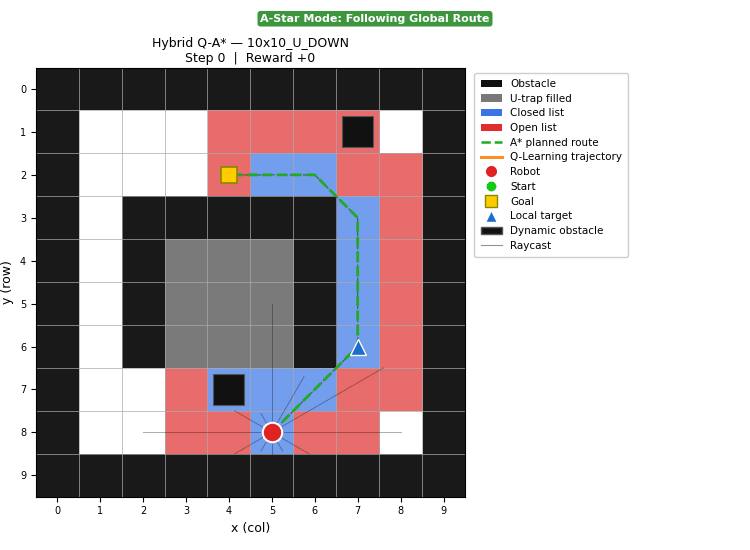
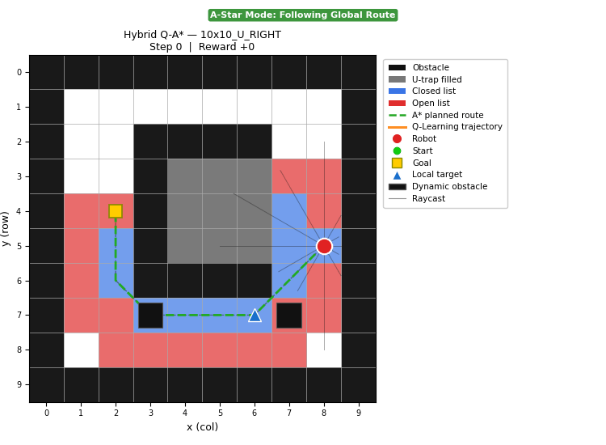
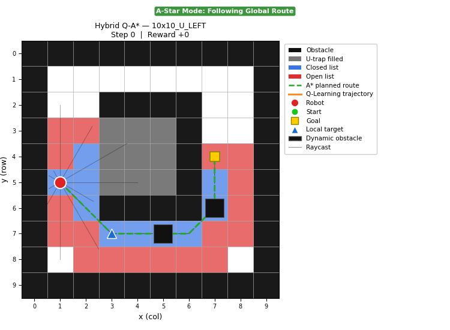
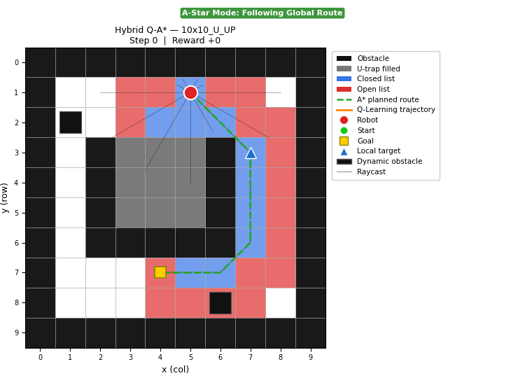
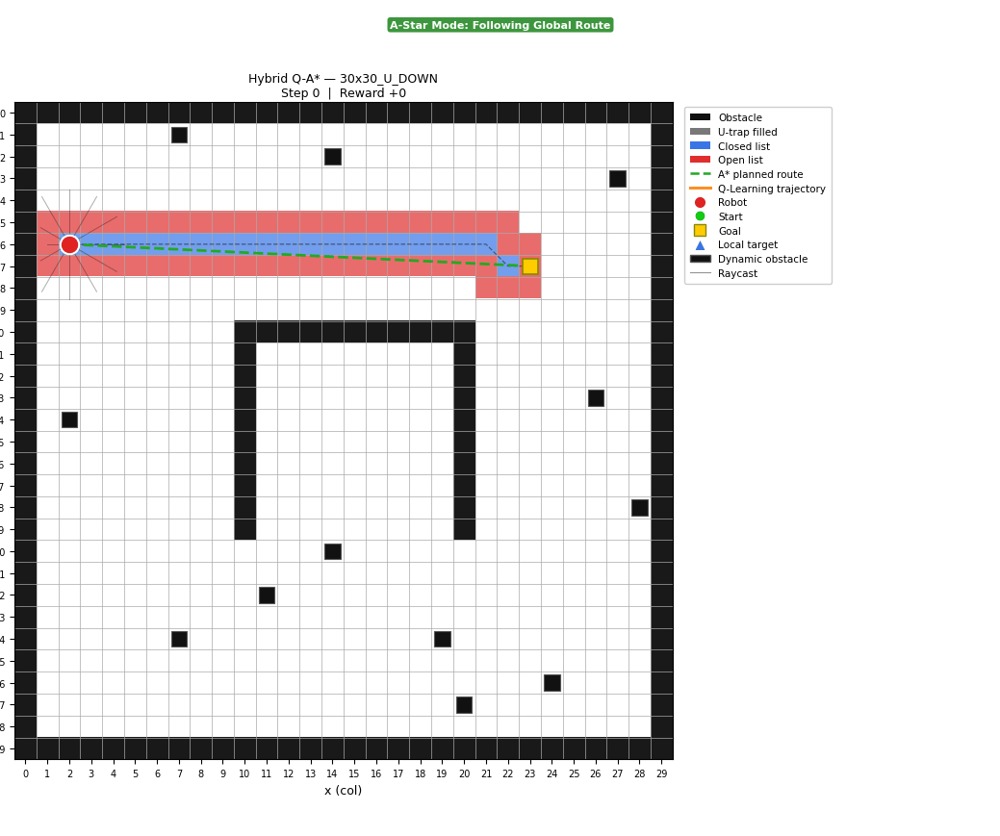
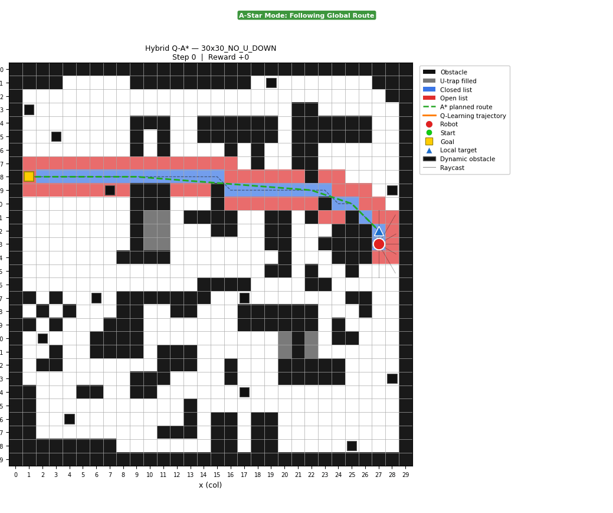

## Hibrit Q-A*: Dinamik Engel Kaçınmalı Navigasyon
Improved A* (küresel planlama) ve Q-Learning (dinamik engel kaçınma) birleştiren hibrit navigasyon sistemi.

Makaleden farklı ilerleyen kısımlar:
- Farklı u rotasyonlarında doğru u tuzak doldurması hatalı olduğu görüldü. Bu sorun için VirtualGrid ile harita 4 yöne döndürülerek tuzak doldurması yapılmıştır.
- Makalede init_memory_matrix hesaplama yükünü azaltmak için sadece 1 kere çalıştırılmaktadır. Her katman doldurma yapıldığında tuzak içine yönelimi önlemek içiin init_memory_matrix tekrar hesaplanmıştır.
- Makalede engel mesafe kontrolü için geometrik (nokta-doğru) mesafe formülü kullanılmaktadır. Bu yaklaşımın grid yapısında köşelere takılma riski taşıdığı görüldüğünden, çok daha kesin sonuç veren hücre tabanlı ışın izleme (Amanatides-Woo) yöntemi kullanılmıştır. Ayrıca hybrid_30x30_U_DOWN test ortamı makaledeki figür 8 ile aynıdır ve makalede Inflection nodes 10 iken uygulanan kodda 15 olmuştur. Makaleye yakın sonuç alındığı içinde Amanatides-Woo yöntemi şeçilmiştir. Bu temel farkın A* algoritmasının izlediği yol seçiminin farklı olmasındandır.

hybrid_30x30_U_DOWN sonuçlarının makale ile karşılaştırılması 
| Değerler | Makale | Uygulanan |
|---------|-------|-------|
|Searched nodes | 136 | 76 |
| Path nodes | 12 | 11 |
|Path inflection |  10 | 9 |
|Turning angle (°)| 201.0238 | 237.9 |
|Pathfinding time (ms)| 41.28 | 33.812 |
|Path length (m) | 36.0076 | 36.2484 |

## Q-Learning Parametreleri
### Durum Uzayı (13 boyut)
| Bileşen | Değer |
|---------|-------|
| Raycast yönü | 12 adet (30° aralık) |
| Raycast mesafe | {0,1,2} (yakın/orta/uzak) |
| Hedef yönü | 8 adet (45° dilim) |

### Aksiyon Uzayı
8 yöne hareket (4 ana + 4 çapraz) 

### Hiperparametreler
| Parametre | Değer | Açıklama |
|-----------|-------|----------|
| alpha | 0.1 | Öğrenme hızı |
| gamma | 0.9 | İndirgeme faktörü |
| epsilon | 0.1 | Başlangıç keşif oranı |

epsilon azalma 0.003

### Ödül Fonksiyonu
| Durum | Ödül |
|-------|------|
| Her adım | -1 |
| Hedefe yaklaşma | +10 |
| Uzaklaşma | -10 |
| Waypoint'e varma | +50 |
| Hedefe varma | +500 |
| Engele çarpma | -100 |
| Dinamik engele çarpma | -500 |

### Mod Geçişi
Tehdit eşiği 2.8 azsa Q-Learning modu; fazlaysa engel yok, uzakta A-star modu

### Eğitim Ayarları
Toplam bölüm : 3000 (Her bir harita 500 bölüm)

Raycast menzili : 3.0 birim 

## Sonuçlar

hybrid_10x10_U_DOWN.gif

hybrid_10x10_U_RIGHT.gif

hybrid_10x10_U_LEFT.gif

hybrid_10x10_U_UP.gif

hybrid_30x30_U_DOWN.gif

hybrid_30x30_NO_U_DOWN.gif

