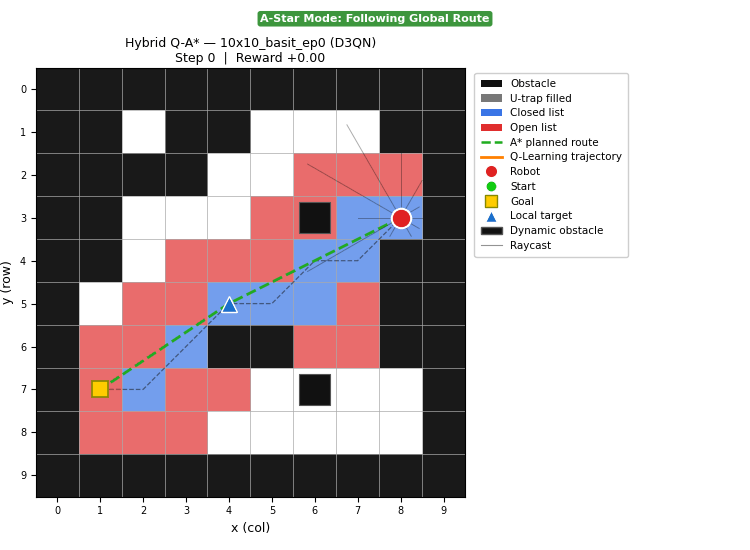
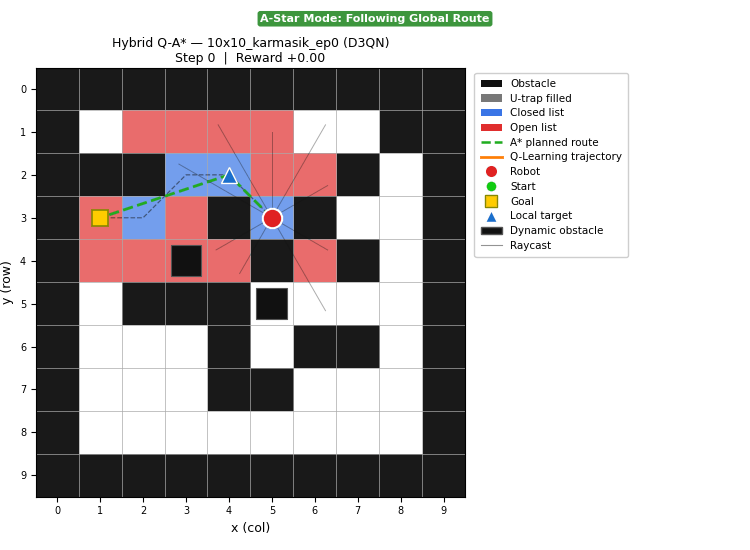
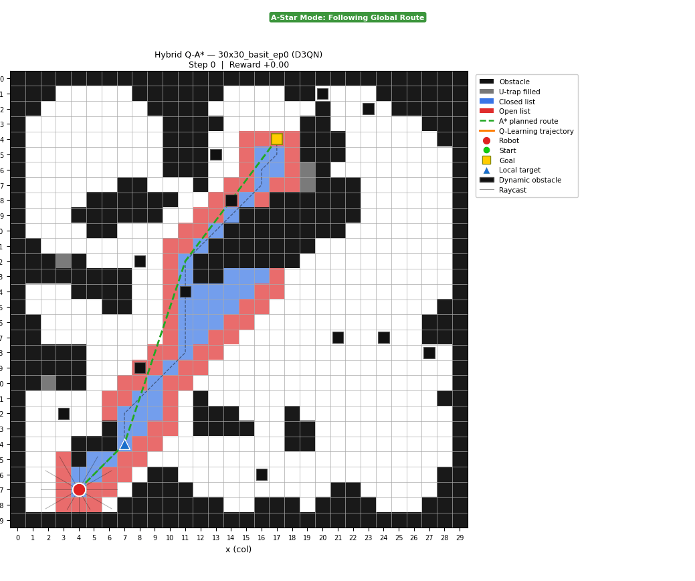
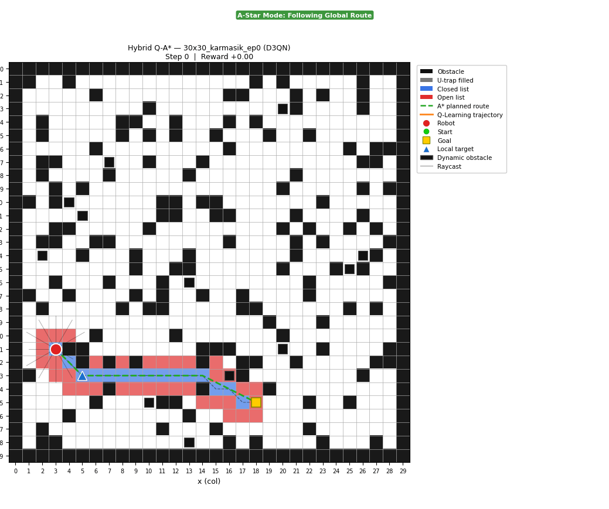
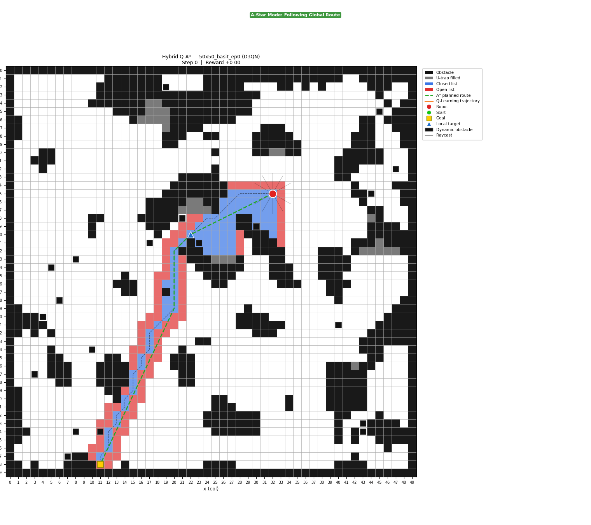
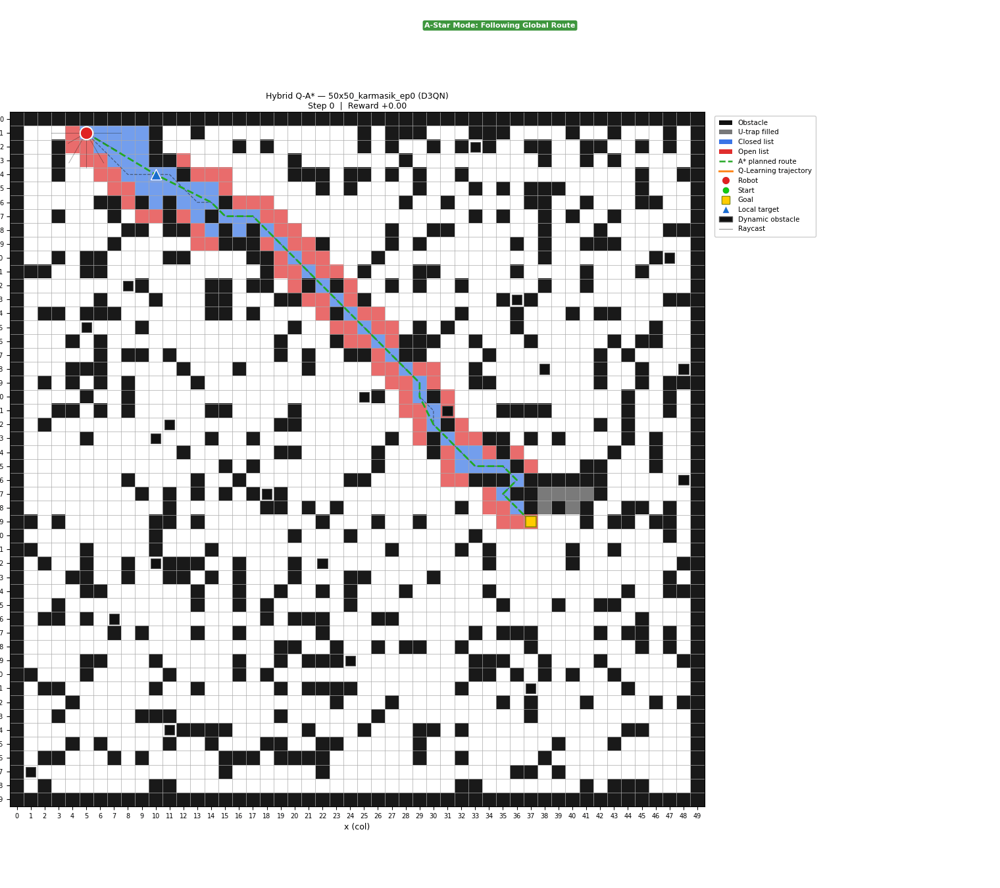

# Hibrit D3QN-A*: Dinamik Engel Kaçınmalı Mobil Robot Navigasyonu

Improved A* (küresel yol planlama) ve Dueling Double DQN (dinamik engel kaçınma) algoritmalarını birleştiren hibrit navigasyon sistemi. Robot, statik engelleri aşmak için A* yolunu izler; dinamik engeller algılandığında ise D3QN ajanı devreye girerek anlık kararlar verir.


## Proje Yapısı

```
mobileRobot/
├── main.py                  # Eğitim ve test modülü
├── hybrid_d3qn_astar.py     # D3QN ajan mimarisi ve hibrit kontrol mantığı
├── agent_env.py             # RaycastAgentEnv ortamı (durum, adım, ödül)
├── improved_astar.py        # U-tuzak doldurmalı Geliştirilmiş A* algoritması
├── grids.py                 # Prosedürel harita ve senaryo üreticisi
├── visualization.py         # GIF ve frame renderer
├── output_hybrid_d3qn/      # D3QN test sonuçları (GIF, log, summary)
└── output_hybrid/           # Q-Learning tabanlı önceki sürüm sonuçları
```


## Hibrit Mimari

### Mod Geçişi

| Durum | Aktif Mod |
|-------|-----------|
| Dinamik engel yok (tüm ray değerleri ≥ 2) | **A\* Greedy** – waypoint'e en kısa mesafeyi izle |
| Dinamik engel algılandı (herhangi bir ray < 2) | **D3QN** – öğrenilmiş politika ile karar ver |

> Tehdit eşiği: `dynamic_ray < 2` (3 birim menzil içinde dinamik engel)


## D3QN Ajan Mimarisi

### Durum Uzayı (26 boyut)

| Bileşen | Boyut | Açıklama |
|---------|-------|----------|
| Statik ray bins | 12 | Her 30°'de 1 ray → {0=yakın, 1=orta, 2=uzak} |
| Dinamik ray bins | 12 | Aynı yönlerde dinamik engel mesafesi |
| Hedef yön bin | 1 | 45°'lik 8 dilimde normalize hedef açısı |
| Hedef mesafesi | 1 | `dist / diagonal` ile normalize edilmiş |

### Aksiyon Uzayı

8 yönlü hareket: 4 ana yön (⇑⇓⇐⇒) + 4 çapraz yön (⇖⇙⇗⇘)

### Ağ Mimarisi — Dueling DQN

```
Giriş (26) → Ortak Gövde (FC 128 → FC 128)
                    ↓
         ┌──────────┴──────────┐
    Value Stream           Advantage Stream
    (FC 64 → V(s))         (FC 64 → A(s,a))
         └──────────┬──────────┘
              Q(s,a) = V(s) + (A(s,a) − mean(A))
```

### Hiperparametreler

| Parametre | Değer | Açıklama |
|-----------|-------|----------|
| `lr` | 0.0003 | Adam öğrenme hızı |
| `gamma` | 0.99 | İndirgeme faktörü |
| `epsilon` | 1.0 → 0.05 | Epsilon-greedy keşif oranı |
| `epsilon_decay` | 0.004 | Her 50 adımda azalma miktarı |
| `buffer_size` | 25,000 | Deneyim havuzu kapasitesi |
| `batch_size` | 64 | Mini-batch boyutu |
| `hidden` | 128 | Gizli katman genişliği |
| `tau` | 0.01 | Soft (Polyak) güncelleme katsayısı |

### Ödül Fonksiyonu

| Durum | Ödül |
|-------|------|
| Her adım | −1 |
| Hedefe yaklaşma | `+dist_diff` × 20 |
| Waypoint'e varma (ilk kez) | +50 |
| Hedefe varma | +500 |
| Statik engele çarpma | −300 |
| Dinamik engele çarpma | −500 |

---

## Eğitim

### Haritalar

Eğitim, 6 farklı prosedürel harita türü üzerinde döngüsel ve karışık sırayla gerçekleştirilir (katastrofik unutmayı önlemek için):

| Harita | Boyut | Dinamik Engel | Tür |
|--------|-------|---------------|-----|
| `10x10_basit` | 10×10 | 2 | Hücresel otomat |
| `10x10_karmasik` | 10×10 | 2 | Gürültülü yoğunluk |
| `30x30_basit` | 30×30 | 12 | Hücresel otomat |
| `30x30_karmasik` | 30×30 | 12 | Gürültülü yoğunluk |
| `50x50_basit` | 50×50 | 20 | Hücresel otomat |
| `50x50_karmasik` | 50×50 | 20 | Gürültülü yoğunluk |

### Eğitim Ayarları

| Parametre | Değer |
|-----------|-------|
| Toplam bölüm | 12,000 |
| Adım başına max adım | 300 |
| Warmup adımı | 256 |
| Öğrenme sıklığı | Her 4 adımda 1 |

## Sonuçlar

**Genel Başarı: 24/30** (%80) — 6 ortam × 5 senaryo üzerinde test edildi.

| Harita | Başarı |
|--------|--------|
| 10×10 Basit | 4/5 |
| 10×10 Karmaşık | 4/5 |
| 30×30 Basit | 4/5 |
| 30×30 Karmaşık | 4/5 |
| 50×50 Basit | 4/5 |
| 50×50 Karmaşık | 4/5 |

### D3QN Test GIF'leri

**10×10 Basit (ep0)**



**10×10 Karmaşık (ep0)**



**30×30 Basit (ep0)**



**30×30 Karmaşık (ep0)**



**50×50 Basit (ep0)**



**50×50 Karmaşık (ep0)**




## Improved A* — Makaleden Farklılaşan Noktalar

Bu proje, [Improved A\* algoritmasını](https://doi.org/10.21203/rs.3.rs-4092115/v1)  temel alır. Uygulama sırasında aşağıdaki farklılıklar ortaya çıkmış ve çözüme kavuşturulmuştur:

- **U-tuzak yönü problemi:** Farklı U rotasyonlarında doğru tuzak doldurması için `VirtualGrid` kullanılarak harita 4 yöne döndürülmüş ve tuzak doldurması her yönde ayrı uygulanmıştır.
- **`init_memory_matrix` yeniden hesaplama:** Makalede hesaplama yükü azaltmak adına yalnızca bir kez çalıştırılmaktadır. Bu uygulamada her katman doldurma sonrasında tuzak yönelimini önlemek için yeniden hesaplanmıştır.
- **Engel mesafe kontrolü:** Makalede geometrik (nokta-doğru) mesafe formülü kullanılmaktadır. Grid yapısında köşe takılmalarını önlemek amacıyla **Amanatides-Woo** hücre tabanlı ışın izleme yöntemi tercih edilmiştir.
